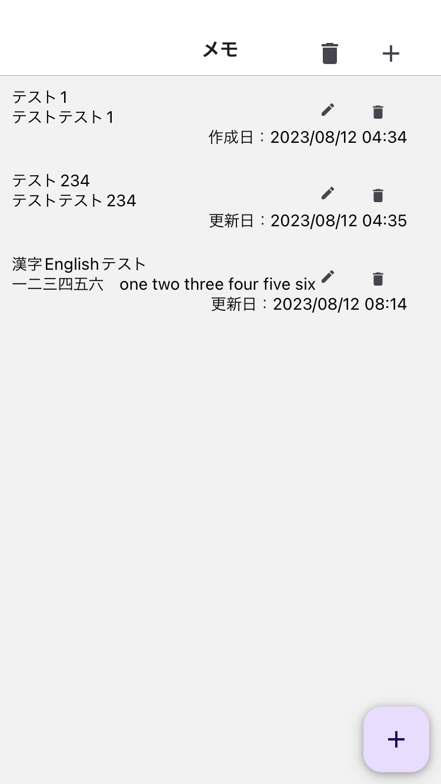
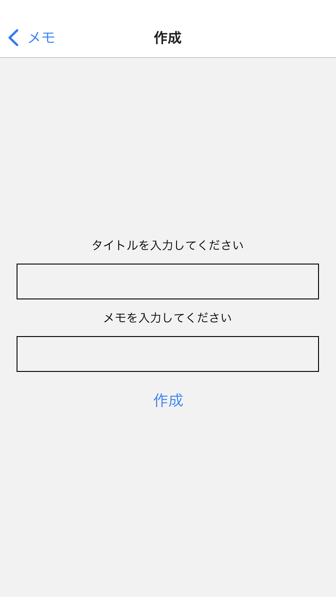

# memo-app

ほかのアプリケーションを呼び出すアプリのサンプルです。

## 目次
- [インストール](#インストール)
- [使用方法](#使用方法)
- [使用したテクノロジー](#使用したテクノロジー)
- [機能](#機能)
- [サムネイル](#サムネイル)

## インストール
memo-appを使うためには、以下の手順に従ってください：

1. スマホにExpoGOをインストール。`https://expo.dev/client`
2. リポジトリをクローン： `git clone https://github.com/yourusername/awesomeapp.git`
3. プロジェクトディレクトリに移動： `cd awesomeapp`
4. 依存関係をインストール： `npm install`
5. 開発サーバーを起動： `npm start`
6. QRコードを読み取る:  iPhoneは純正のカメラ、androidはexpoGoのScanQRcodeから。

## 使用方法
1. メモ作成     ヘッダーまたは右下の＋ボタンで作成ページへ移動
2. メモを編集   ペンボタンで編集
3. メモを削除   ゴミ箱ボタンで削除。ヘッダーのゴミ箱では全て削除が可能。

## 使用したテクノロジー
- 

## 機能
- メモを作成
- メモを編集
- メモを削除

## サムネイル
iOS

